<p align="center">
  
</p>

<p align="center">
  
</p>

---

<h3 align="center">⚡ Full Stack • DevOps • Cloud • Automation ⚡</h3>

<p align="center">
  <a href="https://www.linkedin.com/in/kuldeep-engineer/">
    
  </a>
  <!-- Facebook commented intentionally -->
  <!-- <a href="#"></a> -->
</p>

---

# 👨‍💻 About Me

```yaml
Name: Kuldeep
Role: DevOps Engineer + Full Stack Developer
Architecture: Scalable & Production Ready
Speciality: Automation + Secure Deployments
Mindset: "You are not failing. You are being trained."
```

---

# 🧠 Technology Stack

## 🚀 Backend
<p>

</p>

## 🎨 Frontend
<p>

</p>

## 🗄️ Databases

| Category | Technologies |
|----------|-------------|
| 🟦 SQL | MySQL • PostgreSQL |
| 🟩 NoSQL | MongoDB |
| 🧠 Vector DB | Pinecone • FAISS |
| ⚡ Cache | Redis |

---

# 🌍 Server & Hosting

- Apache2 Server  
- Nginx  
- Shared Hosting Deployment  
- VPS Configuration  
- Linux Administration  
- SSL Installation  
- DNS & Domain Management  

---

# ☁️ Cloud & DevOps

<p>

</p>

- CI/CD Pipelines  
- GitHub Actions  
- Dockerized Applications  
- Kubernetes Basics  
- AWS EC2 / S3  
- AWS Lambda (Serverless Architecture)  
- Log Monitoring  
- Performance Optimization  

---

# 🧩 APIs & CMS

- REST APIs  
- GraphQL APIs  
- Strapi CMS  
- JWT Authentication  
- OAuth Integration  
- Google APIs  
- Mailchimp Integration  
- Mandrill Email Automation  

---

# 💳 Payment Gateway Experience

✔ Razorpay  
✔ Stripe  
✔ Webhook Handling  
✔ Subscription Systems  
✔ Secure Validation  

---

# 🔁 Dev Workflow

```mermaid
flowchart LR
A[Code] --> B[Git Push]
B --> C[CI/CD Pipeline]
C --> D[Docker Build]
D --> E[Deploy to VPS]
E --> F[Apache2 / Nginx]
F --> G[Production 🚀]
```



---

# 🔥 Skill Chips (Rounded)


---

# 📊 GitHub Analytics

<p align="center">
  
  
</p>

---

# 📫 Contact

📩 Zoho Mail: kuldeepkuldeep@zohomail.in  
🔗 LinkedIn: https://www.linkedin.com/in/kuldeep-engineer/

---

# ⚡ Engineering Philosophy

> Automate everything possible.  
> Build scalable systems.  
> Deploy confidently.  
> Keep learning.

---

<p align="center">
  
</p>

<!-- ================= END ================= -->
